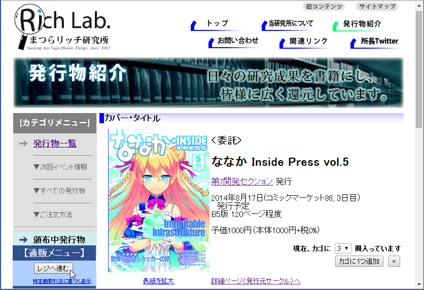
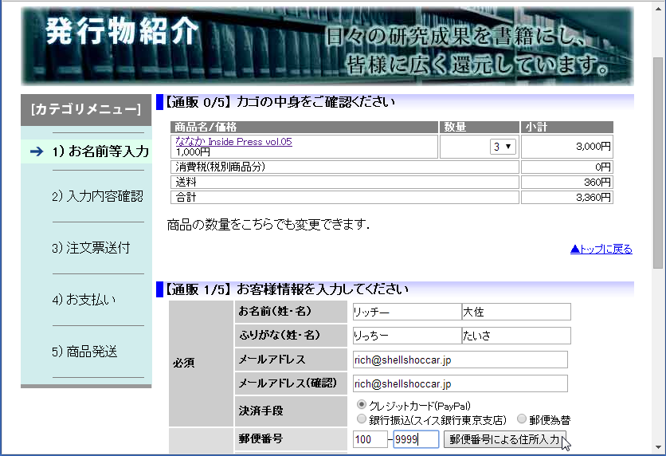
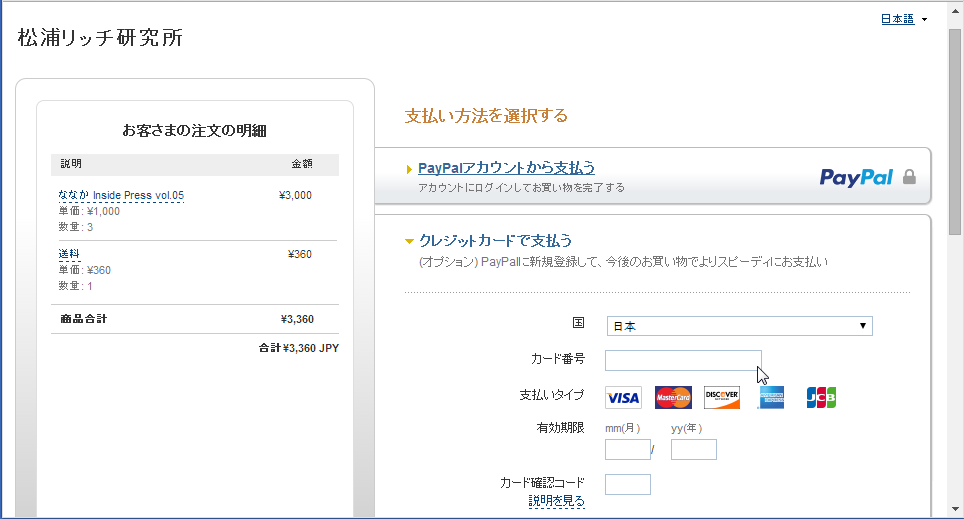
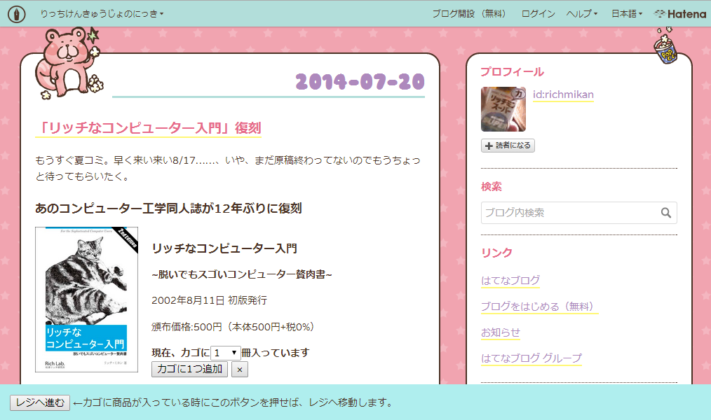

見よ! このショッピングカートを
======================================================================

ではそろそろ、侵略型ショッピングカートの実物を見せてやる。
名前は、崇高なる我々の組織の名称からとって **「シェルショッカー1号」** である [#name_of_ShellSoccar]_ 。

.. rubric:: 脚注

.. [#name_of_ShellSoccar] ホントは、 **シェル** スクリプト製 **ショッ** ピング **カー** トから来ているというのはヒミツだ!


実物はこれだ
----------------------------------------------------------------------

見よ、これが我々が独自に開発したシェルスクリプト製ショッピングカートだ!
動くものが見たければ ``http://richlab.org/coterie/`` にアクセスするがよい。



   ショッピングカートに改造されたページ

我々が世を忍ぶ仮の同人サークルとして管理してきた「まつらリッチ研究所」の
同人誌紹介ページを、ショッピングカートに改造したのだ。
商品画像の横に「カゴに1つ追加」というボタンがあり、
画面左下には「レジへ進む」ボタンがあるのがわかるな。

このサイトでは、レジへ進むボタンをWebブラウザー画面の左下に
しつこく陣取るようにしてあって、画面を上下スクロールさせても追尾していく。
このページを見たら最後、ページ訪問者の目の前に「レジへ進む」という
暗黒世界への扉が常に口を開けて待ち構えているというわけだ。
わっはっは!



   「お客様情報入力画面」暗黒世界への入り口

レジへ進めば、よくあるショッピングカートアプリと同様、
カゴに入っている商品の確認(数量変更も可能)と、お客様情報入力欄が現れる。
今どき当たり前の郵便番号による住所自動入力機能(Ajax)も装備しており、
訪問者に気持ちよく入力してもらいながら最後に「注文」ボタン押下までいけば
個人情報を集めるのだ、わっはっは!

念を押しておくが、Webブラウザー上のJavaScriptは置いといて、
サーバー上のプログラムは全てシェルスクリプトだからな。



   PayPal誘導機能も実装し、組織運営の資金源に

購入者の個人情報を取得したら、最後に必要なのは代金支払い手続きだ。
クレジットカードによる購入を選択した顧客にメールを送りつけ、
そこに書き込まれているURLを踏ませればPayPalへ誘導されるようになっている。

というわけでクレジットカード決済には PayPal を使うようにした [#PayPal]_ 。
PayPalのAPIを独自解析 [#PayPalAPI]_ し、ようやく繋ぎ込みに成功した。
表世界のクレジットカードから代金が引き落とされることもちゃんと確認済だ。
これで、組織の資金源もきちんと確保できる。
洗脳アイテムを売り、資金も集める。なんとすばらしいブラックエコシステムではないか。

シェルスクリプト向けのPayPal APIライブラリーなどというものは存在せんので、
もちろんここもシェルスクリプトで自作したのだ。仕組みは後で語ることにしよう。

.. コメント: ToDo 「後で語る」の部分にリンクをつける

.. rubric:: 脚注

.. [#PayPal]              技術的にはPayPal以外だってもちろんできる。が、PayPalだと個人や同人サークルという表の顔でも審査に通れるし、最も都合がいいのだよ。初期費用も不要だしな。
.. [#PayPalAPI]           一応APIの開発者向け公開資料はあるが、不明な点も多く、サポートに問い合わせたらたらい回しされた挙句、求める回答は一度も得られなかった。「オープンな仕様」ってレベルじゃねぇぞ!


敵に息つかせぬスピードで開発する
----------------------------------------------------------------------

シェルショッカー1号の恐るべき特長、
それはまずは何と言っても開発期間の短さにある。

このプログラムの大部分は、実質1週間で書きあげた。
敵に息つかせぬこのスピードこそが世界征服には重要なのだが、
開発期間を圧縮できた理由は、シェルスクリプト開発を採用した以外に、2つある。

その1、商品説明ページは、他人のページを「改造」して作る
``````````````````````````````````````````````````````````````````````

これは「シェルショッカー1号」の最大の特徴にして特長なのだが、
**自ら商品ページを作らない** ということだ。

先程見せたサイトも、もともとあった素のHTMLに僅かな改造を施して作ったものだが、
飽くまで我々のサイトだったからピンとこなかったかもしれんな。
ならばこれを見るがいい! URL→ ``http://richlab.hatenablog.com/``



   はてなブログも「シェルショッカー1号」で侵略

これはどうみてもはてなブログだな。
このように、我々の手に掛かればよそのサイトだろうと改造が可能なのだ。
しかも改造は簡単。独自の JavaScript ファイルを1つ、<script>タグで読み込ませ [#original_JS]_ 、
あとは「かごに入れる」とか「レジへ進む」といったボタン類を貼り付けるだけでよい。

これで、手打ちHTMLだろうが、WordPressなどのブログCMSが吐くページでも、
あるいはブログサービスサイトが吐くページでも、いとも簡単にショッピングカートに改造できるのだ。

世界征服も捗るというものだ。どぅぉーだ、スゴいだろう。

これというのも *サードパーティーCookie* のおかげなのだがな。「買い物カゴの章」でちょっと解説してやる。

.. rubric:: 脚注

.. [#original_JS]         jQuery等の汎用ライブラリーなど一切使っておらんので、既にあるライブラリーや、バージョン衝突で悩まされることもないのだ。


その2、商品登録も自分でやれぃ
``````````````````````````````````````````````````````````````````````

もう一つの特徴は、商品登録ページというのも存在しない点だ。
そもそも、商品紹介ページを他のブログ等で勝手に作れと言っているのだから、
商品画像や説明文を登録する欄を用意してもまったく意味がないからな。

とは言え、カゴに入れた後に必要になる最低限の情報(下記)は持っていなければならない。

- 商品名
- 価格
- 最初の在庫数
- 重さや厚さ(送料計算時に必要)

しかし、そんなものはテキストファイルに書けば済む話だ。

	いちいち設定画面など作るの面倒だ! そんなもんテキストエディターで直接書けぃ!

と言いたい。そんなものいちいち作るからプログラムが肥大化していくのではないか。
**シェルスクリプトは、コマンド呼んで他人任せにするのが真髄。**
設定ファイルの書き換えだって、テキストエディターで書き換えて、
ファイルアップローダーでアップして済ませれば、何も開発せずに事足りるのだよ。

というわけで、「シェルショッカー1号」の商品設定ファイル(商品マスター)はこうなっている。

.. code-block::

	#商品ID   品名(mojihame escape)       単価 発売日    大きさ    在庫情報体 URL            …
	RPC       リッチなコンピューター入門   500 20020901  5mm,182g  @          http://richlab …
	7sec_ip05 ななか_Inside_Press_vol.05  1000 20140817  10mm,300g @          http://richlab …
	  :
	  :

テキストエディターは、viでもemacsでも、あるいはリモートからNotepadでもmiでも……、好きなのを使えばよい。

コピーするだけ、デプロイ完了
----------------------------------------------------------------------

他にもいろいろと特徴があるが、あと1つだけ言わねばならぬこと。
それは **コピーすりゃ、どこでも使える** ということだ。

なぜなら「シェルショッカー1号」が必要とするソフトは表に記したものだけだからだ。

.. table:: 「シェルショッカー1号」が求めるもの

   +---------------------+-----------------------------------+ 
   | 必要なもの          | 備考                              |
   +=====================+===================================+
   | POSIX準拠シェルと   | FreeBSDやLinuxも勿論OK            |
   | コマンド群          | (BashやGNU拡張機能等は一切不要)   |
   +---------------------+-----------------------------------+
   | mktempコマンド      | (AIXには無かったが)大抵のOSにある |
   |                     | (一応、ソースコードも付けた)      |
   +---------------------+-----------------------------------+
   | truncateコマンド    | (CentOS5には無いが)大抵のOSにある |
   |                     | (一応、ソースコードも付けた)      |
   +---------------------+-----------------------------------+
   | flockまたは         | (MacOS Xには無いが)大抵のOSにある |
   | lockfコマンド       | (一応、ソースコードも付けた)      |
   +---------------------+-----------------------------------+
   | sendmailコマンド    | 主要なUNIX系OSには大抵入ってるが  |
   |                     | 無ければインストールしておく      |
   +---------------------+-----------------------------------+
   | curlコマンド        | インストールしておく              |
   |                     | (主要Linuxディストリには大抵ある) |
   +---------------------+-----------------------------------+
   | nkfコマンド         | インストールしておく              |
   |                     | (主要Linuxディストリには大抵ある) |
   +---------------------+-----------------------------------+
   | Apache等のHTTPd     | あらかじめインストールしておく    |
   +---------------------+-----------------------------------+

どれも主要なOSには初めから入っているものが多いし、
入っていなくても簡単にインストールできるものばかり [#if_unavailabled]_ 。
気軽にインストール作業のできないレンタルサーバーでも、大抵これらは入っている。

ちなみに表にも書いたが、シェルとコマンドは断りのない限りPOSIXの範囲で動く。
BashやGNU拡張やLinux環境という機種依存な環境を、それがUNIX一般の話であるかのごとく語ったりするフトドキ者が一部におって、忌々しい!
そんな愚か者どもが作るドキュメントなど ``rm -rf *`` だ!!

.. rubric:: 脚注

.. [#if_unavailabled]     最悪、無くても「シェルショッカー1号」のリポジトリーに、それらのソースコードを付けておいので、コンパイルして用意することはできる。


コンパイル、他言語、DB……、どれも不要でラクラク世界征服!
``````````````````````````````````````````````````````````````````````

ということは、例えプログラムの別サーバー移転を迫られてもコピーすればそれでおしまい。
あとは設定ファイルをちょこっと書き換えるだけでよい。
少なくともコンパイルやデータベースのインポート・エクスポートなどといった作業とは無縁だ。
また、バージョン問題に苛まれる可能性も低い。この中で言えばせいぜいApacheくらいなものだ。

おかげで **第一特集のImmutable Infrastructureにもとーってもやさしい** はず!

そして、よそのWebページのみならず、「シェルショッカー1号」のプログラムも
あちこちに持っていきやすいから、世界征服もやりやすいというものだ。

**さあお前たちも、「シェルショッカー1号」でネットショップを開いてしまえー!**
はっはっは!
