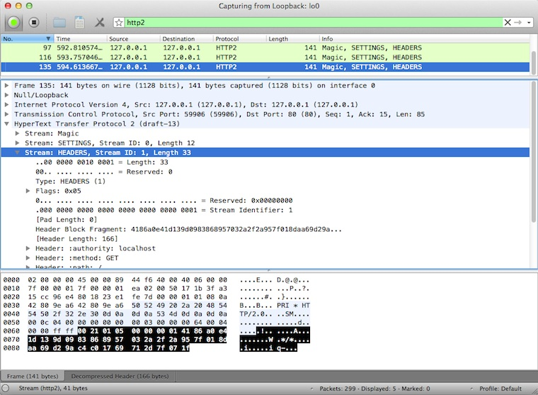

今すぐ試そうHTTP/2
==================

こんにちは、 @syu_cream です。普段は某 web 系企業でバックエンドのシステムを支える裏方的な業務をしています。

本稿では、次世代 web プロトコルとして最近注目を浴びている HTTP/2 の、早くも存在している色々な実装についてつらつらと書いていきます。
HTTP/2 というプロトコル自体についての詳しい説明については本稿ではあまり触れません。その辺は既存の資料に丸投げさせて頂きます。
また、本稿の内容は旬の内容なので時間が過ぎれば役に立たなかったり事情が変わっている場合があります。ご了承ください。

はじめに
---------

HTTP/2 の簡単な説明
--------------------

概要
^^^^^

HTTP/2 は現在広く利用されている HTTP/1.1 のパフォーマンス面の課題を解消しつつ、 HTTP/1.1 とセマンティックを共有することでアプリケーションの実装を変更せずに済むことを念頭に置かれたプロトコルです。
HTTP/2 は Google の提唱した SPDY をベースに仕様策定が進められ、 2014 年 7 月現在で 13 番目のドラフトが発行されています。

既存の実装
^^^^^^^^^^

HTTP/2 の実装は既に世の中にいくつか存在します。
仕様自体にまだ Last Call がかかっていない都合、多くの実装が試験的に機能提供しているという状態です。

よく知られた実装については、 HTTP/2 の仕様策定について議論するための GitHub のリポジトリの Wiki に記載されています。 [*]_ 

.. [*] https://github.com/http2/http2-spec/wiki/Implementations

HTTP/2 実装を動かしてみる
--------------------------

サーバを動かしてみる
^^^^^^^^^^^^^^^^^^^^^

nghttp2
""""""""

Apache Traffic Server
""""""""""""""""""""""

クライアントを動かしてみる
^^^^^^^^^^^^^^^^^^^^^^^^^^^

nghttp2
"""""""""

Google Chrome Canary
"""""""""""""""""""""

Firefox Nightly Build
"""""""""""""""""""""""

周辺ツールを使ってみる
^^^^^^^^^^^^^^^^^^^^^^^^

curl
"""""

Wireshark
""""""""""

みんな大好きネットワークアナライザの Wireshark も、開発版では HTTP/2 をサポートしています。
通常通り解析対象のインタフェースを選択し、フィルタとして "http2" を入力します。
するとアラ不思議！やり取りされている HTTP/2 フレームの種類とその内容が判別できます。

下図は実際に開発版 Wireshark で HTTP/2 フレームをキャプチャしてみた図です。
Magic Octet（HTTP/2通信開始時に送られる 24 ビットの固定の文字列）、 SETTINGS フレーム、 HEADERS フレームがやり取りされているのが分かります。
HEADERS フレームは HPACK という独自の圧縮形式で圧縮されているのですが、それをうまく展開し内容が確認できているのが分かります。

   開発版 Wireshark で HTTP/2 フレームを覗き見ているシーン

Wireshark の HTTP/2 対応は残念ながら正式にサポートされている訳ではなく、利用したい場合は下記 URL の git リポジトリからコードを取得して自前でビルドする必要があります。

::

   https://code.wireshark.org/review/wireshark

Mac OS X を利用している場合、 Homebrew で HEAD 版を入れてしまうのが手っ取り早いかも知れません。

::

   brew install wireshark -HEAD

h2load
"""""""

まとめ
-------

